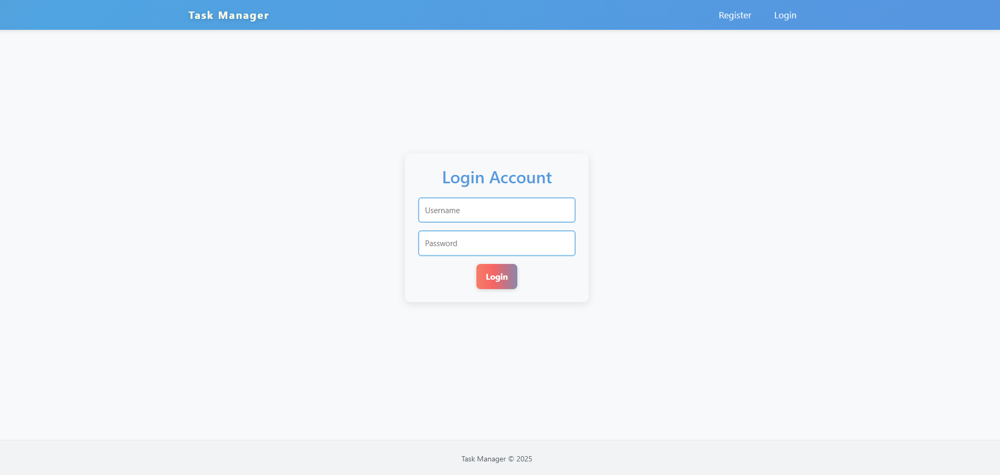
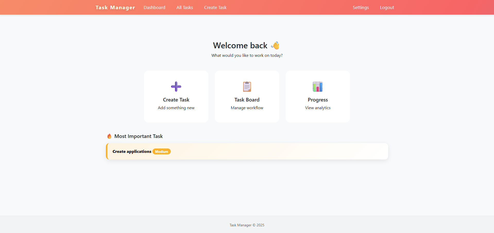
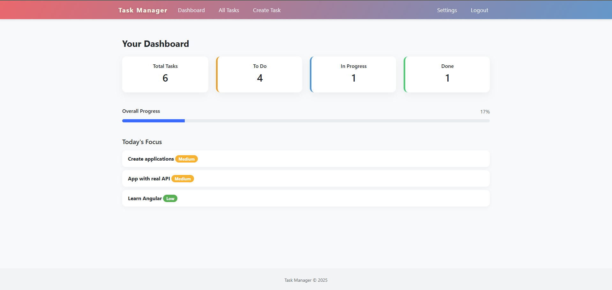
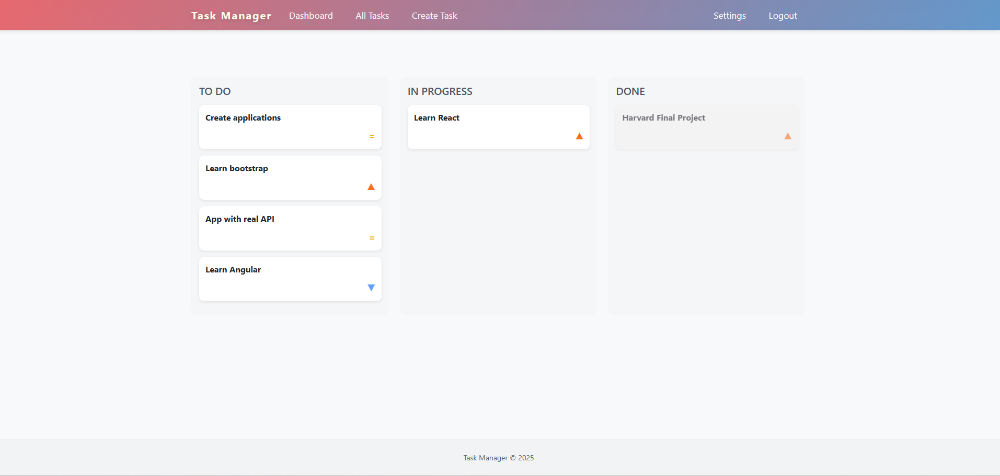
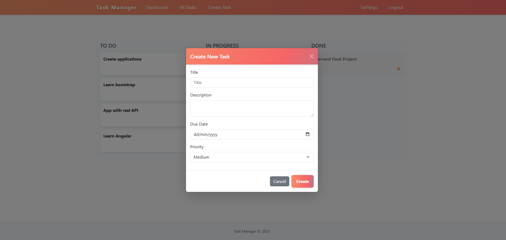

# 📋 Task Manager App

A modern and responsive **Task Management Web Application** built with
Flask that helps users organise, prioritise, and track tasks efficiently
using a clean Kanban workflow.

------------------------------------------------------------------------

## 🚀 Features

-   Secure user authentication (Register / Login / Logout)
-   Create, update and manage tasks
-   Drag & Drop Kanban Board (To Do → In Progress → Done)
-   Task priorities (Low / Medium / High)
-   Dashboard with real-time statistics & progress bar
-   Highlighted "Most Important Task"
-   Responsive modern UI
-   Modal-based task editing
-   Password hashing for security

------------------------------------------------------------------------

## 🖥️ Demo Screenshots

### 🔐 Login Page



### 🏠 Home Page

Quick access to key actions and Most Important Task\


### 📊 Dashboard Analytics

Task stats and overall completion progress\


### 🗂 Kanban Board

Drag & drop tasks between workflow stages\


### ➕ Create Task Modal

Add new tasks using a clean modal interface\


------------------------------------------------------------------------

## 🛠️ Tech Stack

  Layer       Technology
  ----------- ----------------------------------
  Backend     Flask (Python)
  Database    SQLite
  ORM         SQLAlchemy
  Frontend    HTML, CSS, Bootstrap, JavaScript
  UI Design   Custom Modern Responsive Theme

------------------------------------------------------------------------

## ⚙️ How To Run Locally

### 1. Clone the repository

``` bash
git clone https://github.com/HalidMY/Task-Manager-App.git
cd Task-Manager-App
```

### 2. Create Virtual Environment

``` bash
python -m venv venv
```

Activate it:

**Windows**

``` bash
venv\Scripts\activate
```

**Mac / Linux**

``` bash
source venv/bin/activate
```

### 3. Install dependencies

``` bash
pip install flask flask_sqlalchemy werkzeug
```

### 4. Run the application

``` bash
python app.py
```

Open your browser:

http://127.0.0.1:5000/

------------------------------------------------------------------------

## 📂 Project Structure

    TODO_APP/
    │
    ├── __pycache__/
    ├── instance/
    │   └── tasks.db
    ├── screenshots/
    │   ├── create-task.png
    │   ├── dashboard.png
    │   ├── home.png
    │   ├── kanban.png
    │   └── login.png
    ├── static/
    │   ├── css/
    │   │   └── styles.css
    │   └── js/
    │       ├── home.js
    │       └── main.js
    ├── templates/
    │   ├── _create_task_modal.html
    │   ├── _edit_task_modal.html
    │   ├── dashboard.html
    │   ├── index.html
    │   ├── layout.html
    │   ├── login.html
    │   ├── register.html
    │   ├── settings.html
    │   └── tasks.html
    ├── utils/
    │   ├── __pycache__/
    │   └── helpers.py
    ├── venv/
    ├── .gitignore
    ├── app.py
    └── README.md

------------------------------------------------------------------------

## 🧭 Usage Flow

1.  Register or Login
2.  Create tasks with title, priority & due date
3.  Drag tasks between columns to update status
4.  View statistics from Dashboard
5.  Click tasks to edit using modal
6.  Manage profile via Settings

------------------------------------------------------------------------

## 🔮 Planned Improvements

-   Dark Mode toggle
-   Task filtering & search
-   Subtasks support
-   Reminders & notifications
-   Task categories / labels
-   REST API for mobile integration

------------------------------------------------------------------------

## 👨‍💻 Author

**Halid Mahmutyazicioglu**\
GitHub: https://github.com/HalidMY

Project Repository:\
👉 https://github.com/HalidMY/Task-Manager-App

------------------------------------------------------------------------

⭐ If you found this project helpful, please consider starring the
repository!
